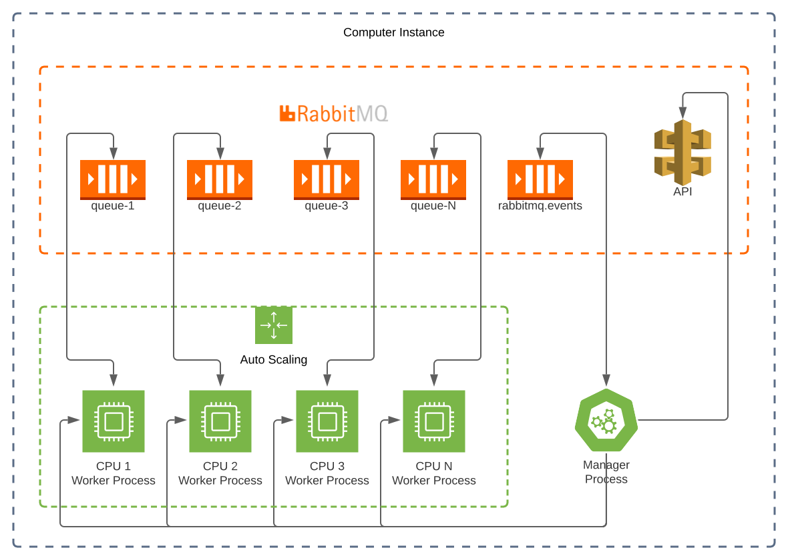

# About project

This project is an idea to solve the problem with several workloads of the same type that need to be executed without blocking using background processes.

To implement this project I studied process model, concurrency, schedulers and distribution. I did choose to implement it, using Node.JS using process resources provided by standard library.

## The problem

Normally, we ca create an queue to publish messages and consume using a process, when this queue is overload, we will add more consumers to reduce it load. This approach work well, while you have only one a client.

After this introduction, we can start think about some problems that will occur with it approach, when add more consumers:

1. clients cannot wait another client conclude the work to start
2. resources are limited
3. computer instances resources are limited
4. computer instances will be crash
5. process will be crash
6. queues need to have exclusive consumers
7. consumers must be up and runnnig while there is a queue

## How this project solve the problems

Initially, this project will launch 1 manager process by computer instances, where it will interact with RabbitMQ API e RabbitMQ Events Queue to spawn 1 worker process for each queue in the broker.

Each worker will consume only 1 queue, and have an owner control to reborn when occur some error that exited it.

-> working in progress

## Execution flow

## How to deploy

-> working in progress

### Architecture

