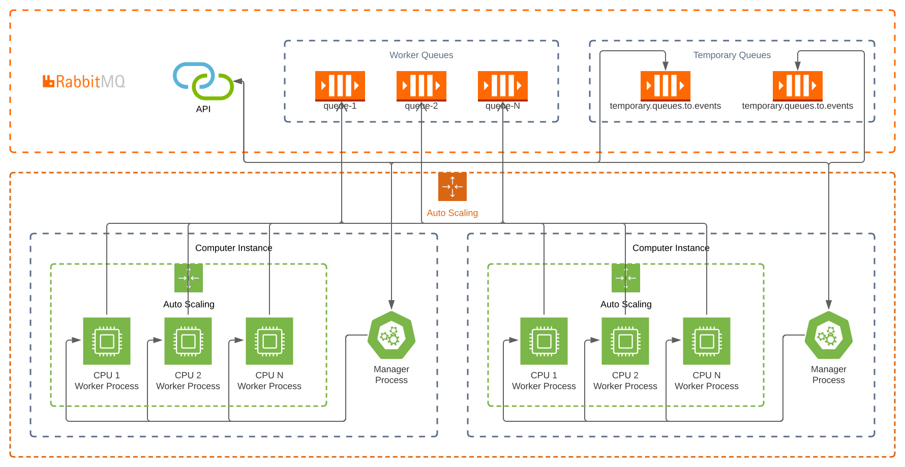

# About project

This project is part of my studies to learn about Process, Concurrency and Schedulers.

Initially this version can launch 1 worker process for each queue, and there are 1 event loop for each worker process.

### Architecture

